<table>
<tr>

<td width="62%" valign="middle">

<h3>Olá, eu sou</h3>

<h1>MAXWELL</h1>

<h3>Estudante de Engenharia de Software</h3>

Sou estudante de Engenharia de Software, com interesse em desenvolvimento backend e banco de dados. Venho construindo meus conhecimentos através dos estudos e da prática, buscando transformar o aprendizado em projetos e experiências práticas.

Atualmente, estou aprimorando meus conhecimentos em SQL, MySQL e Docker, enquanto continuo evoluindo na área de desenvolvimento. Busco minha primeira oportunidade na área de tecnologia, onde possa colocar meus conhecimentos em prática, aprender com novos desafios e contribuir com a equipe.

</td>

<td width="38%" align="center">

  

<b>Anápolis - GO</b>

</td>

</tr>
</table>

---

<h2>Tecnologias</h2>

 

 

---

<h2>Ferramentas</h2>

 

 

---

<h2>Objetivo</h2>

 

<b>Construindo, aprendendo e evoluindo.</b>

Meu objetivo é continuar desenvolvendo meus conhecimentos na área de tecnologia,
transformando meus estudos em projetos práticos e evoluindo constantemente como
profissional. Busco minha primeira oportunidade na área de tecnologia, onde possa
colocar meus conhecimentos em prática, aprender com novos desafios e contribuir
com a equipe.

 

---

<h2>GitHub Stats</h2>

 

 

---

<h2>Onde me encontrar</h2>

 

  

<b>Construindo, aprendendo e evoluindo.</b>

