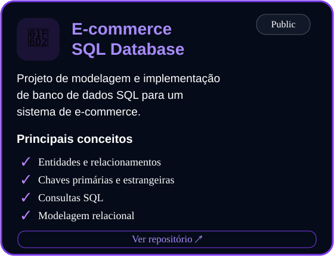
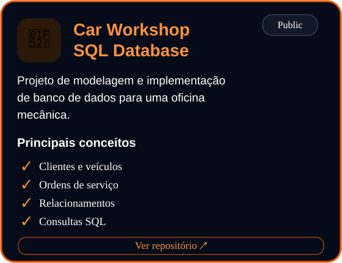
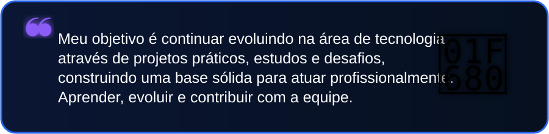

  

 

<table>
<tr>

<td width="62%" valign="middle">

### Olá, eu sou

# Maxwell

### Estudante de Engenharia de Software

Sou estudante de Engenharia de Software com foco em desenvolvimento backend. Busco transformar aprendizado em projetos práticos, evoluindo constantemente por meio dos estudos e da experiência adquirida em cada projeto.

Meu objetivo é conquistar minha primeira oportunidade na área de tecnologia, continuar aprendendo e contribuir com soluções de qualidade.

</td>

<td width="38%" align="center">

  

**📍 Anápolis - GO**

 

 

 

 

</td>

</tr>
</table>

---

## Stack Principal

 

  &nbsp;&nbsp;&nbsp;&nbsp;
  &nbsp;&nbsp;&nbsp;&nbsp;
  &nbsp;&nbsp;&nbsp;&nbsp;
  &nbsp;&nbsp;&nbsp;&nbsp;
  

  <b>Node.js</b>
  &nbsp;&nbsp;&nbsp;&nbsp;
  <b>PostgreSQL</b>
  &nbsp;&nbsp;&nbsp;&nbsp;
  <b>Docker</b>
  &nbsp;&nbsp;&nbsp;&nbsp;
  <b>Git</b>
  &nbsp;&nbsp;&nbsp;&nbsp;
  <b>VS Code</b>

---

## Atualmente estudando

 

  Node.js &nbsp; • &nbsp;
  APIs REST &nbsp; • &nbsp;
  Docker &nbsp; • &nbsp;
  PostgreSQL &nbsp; • &nbsp;
  Git e GitHub

---

## Status

 

<table>
<tr>

<td>
  
</td>

<td>
  
</td>

</tr>
</table>

---

## Contribuições

 

<picture>
  <source
    media="(prefers-color-scheme: dark)"
    srcset="https://raw.githubusercontent.com/MaxwellSilvaDev/MaxwellSilvaDev/output/github-contribution-grid-snake-dark.svg"
  />
  <source
    media="(prefers-color-scheme: light)"
    srcset="https://raw.githubusercontent.com/MaxwellSilvaDev/MaxwellSilvaDev/output/github-contribution-grid-snake.svg"
  />
  
</picture>

---

## Projetos em Destaque

<table>
<tr>

<td width="50%" align="center">

  

</td>

<td width="50%" align="center">

  

</td>

</tr>
</table>

---

## Objetivo

---

## Onde me encontrar

<table>
<tr>

<td width="50%" align="center">

  

</td>

<td width="50%" align="center">

  

</td>

</tr>
</table>

 

**Construindo hoje as habilidades para desenvolver as soluções de amanhã.**

