<table>
<tr>

<td width="62%" valign="middle">

### 👋 Olá, eu sou

# MAXWELL

### 💻 Estudante de Engenharia de Software

Sou estudante de Engenharia de Software com foco em desenvolvimento backend e banco de dados. Venho desenvolvendo meus conhecimentos por meio dos estudos e da prática, transformando aprendizado em projetos e experiências reais.

Atualmente, estou aprofundando meus estudos em **SQL, MySQL e Docker**, enquanto continuo evoluindo no desenvolvimento backend. Busco minha primeira oportunidade na área de tecnologia para aprender, crescer e contribuir com a equipe.

</td>

<td width="38%" align="center">

  

**📍 Anápolis - GO**

 

 

 

 

</td>

</tr>
</table>

---

## Tecnologias

 

  &nbsp;&nbsp;&nbsp;&nbsp;&nbsp;
  &nbsp;&nbsp;&nbsp;&nbsp;&nbsp;
  

  <b>MySQL</b>
  &nbsp;&nbsp;&nbsp;&nbsp;&nbsp;&nbsp;&nbsp;&nbsp;
  <b>PostgreSQL</b>
  &nbsp;&nbsp;&nbsp;&nbsp;&nbsp;&nbsp;&nbsp;&nbsp;
  <b>Docker</b>

---

## Ferramentas

 

  &nbsp;&nbsp;&nbsp;&nbsp;&nbsp;&nbsp;&nbsp;&nbsp;
  

  <b>GitHub</b>
  &nbsp;&nbsp;&nbsp;&nbsp;&nbsp;&nbsp;&nbsp;&nbsp;
  <b>VS Code</b>

---

## 📊 Status

 

<table>
<tr>

<td>

</td>

<td>

</td>

</tr>
</table>

---

## 📁 Projetos em Destaque

<table>
<tr>

<td width="50%" align="center">

</td>

<td width="50%" align="center">

</td>

</tr>
</table>

---

## 🚀 Objetivo

---

## Onde me encontrar

<table>
<tr>

<td width="50%" align="center">

</td>

<td width="50%" align="center">

</td>

</tr>
</table>

 

**❤️ Construindo, aprendendo e evoluindo.**

