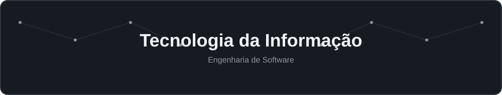
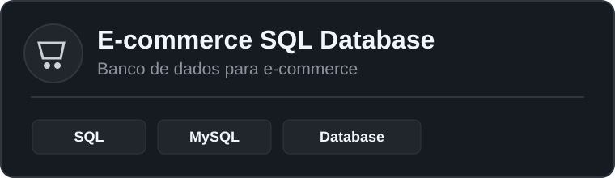
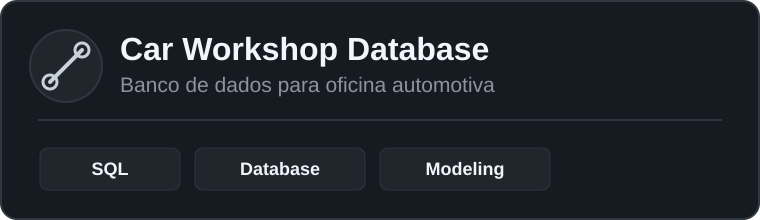
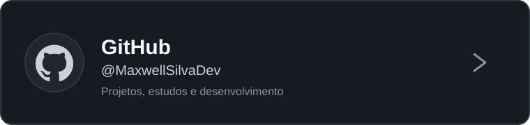
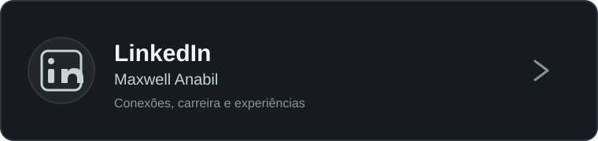

  

 

<table>
<tr>

<td width="62%" valign="middle">

### 👨‍💻 Sobre mim

## Olá, eu sou Maxwell

**Estudante de Engenharia de Software**

Sou estudante de Engenharia de Software com foco em desenvolvimento backend.

Busco transformar aprendizado em projetos práticos, evoluindo constantemente por meio dos estudos e das experiências adquiridas em cada projeto.

> **Construindo, aprendendo e evoluindo.**

</td>

<td width="38%" align="center">

  

**📍 Anápolis - GO**

  

  

  &nbsp;

  

  &nbsp;

  

</td>

</tr>
</table>

---

## Tecnologias e Ferramentas

 

<table>
<tr>

<td align="center" width="20%">
  
    
  <b>Node.js</b>
</td>

<td align="center" width="20%">
  
    
  <b>PostgreSQL</b>
</td>

<td align="center" width="20%">
  
    
  <b>Docker</b>
</td>

<td align="center" width="20%">
  
    
  <b>Git</b>
</td>

<td align="center" width="20%">
  
    
  <b>VS Code</b>
</td>

</tr>
</table>

---

## Atualmente estudando

 

  
  &nbsp;
  
  &nbsp;
  
  &nbsp;
  
  &nbsp;
  

---

## Projetos em Destaque

 

<table>
<tr>

<td width="50%" align="center">

  

</td>

<td width="50%" align="center">

  

</td>

</tr>
</table>

---

## GitHub Stats

 

<table>
<tr>

<td>
  
</td>

<td>
  
</td>

</tr>
</table>

---

## Contribuições

 

<picture>

  <source
    media="(prefers-color-scheme: dark)"
    srcset="https://raw.githubusercontent.com/MaxwellSilvaDev/MaxwellSilvaDev/output/github-contribution-grid-snake-dark.svg"
  />

  <source
    media="(prefers-color-scheme: light)"
    srcset="https://raw.githubusercontent.com/MaxwellSilvaDev/MaxwellSilvaDev/output/github-contribution-grid-snake.svg"
  />

  

</picture>

---

## Onde me encontrar

 

<table>
<tr>

<td width="50%" align="center">

  

</td>

<td width="50%" align="center">

  

</td>

</tr>
</table>

 

**Construindo hoje as habilidades para desenvolver as soluções de amanhã.**

